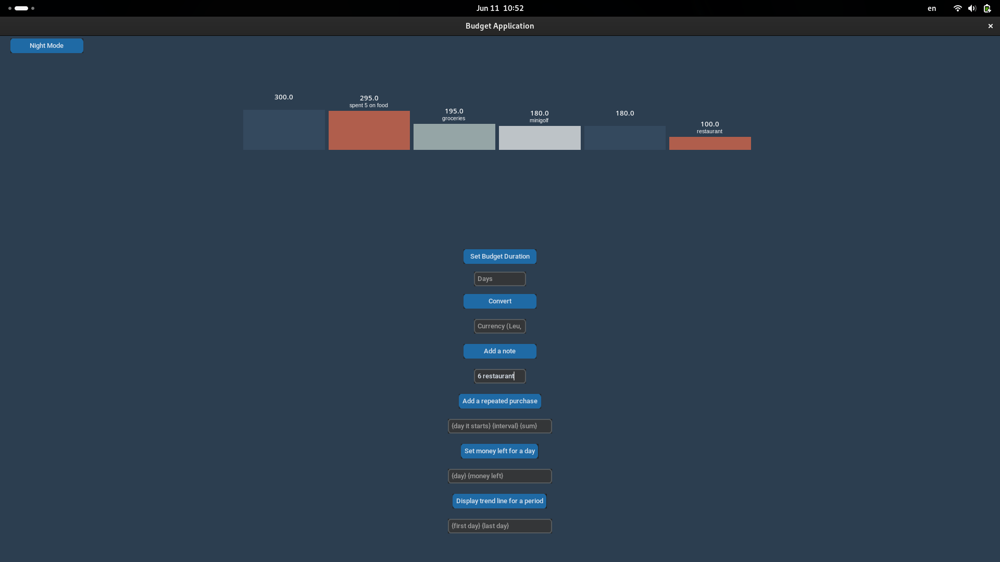
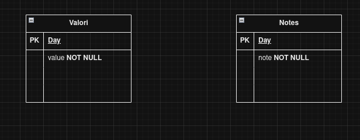
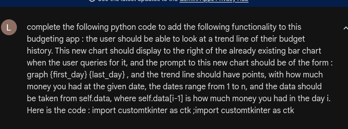
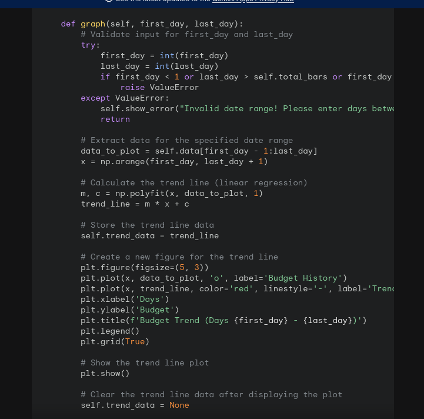

# Aplicatie de budgetare 

### Screenshot cu UI

### Backlogul cu user stories:
https://trello.com/b/xGQJSRWC/proiect-gestionare-buget

### Diagrama UML

### Diagrama Bazei de date

### Prompt engineering 
Prompt:

Resultat (codul a fost modificat putin ca sa se incadreze in aplicatie):

### Teste automate

(implementat in metoda test_update_value in new.py)

