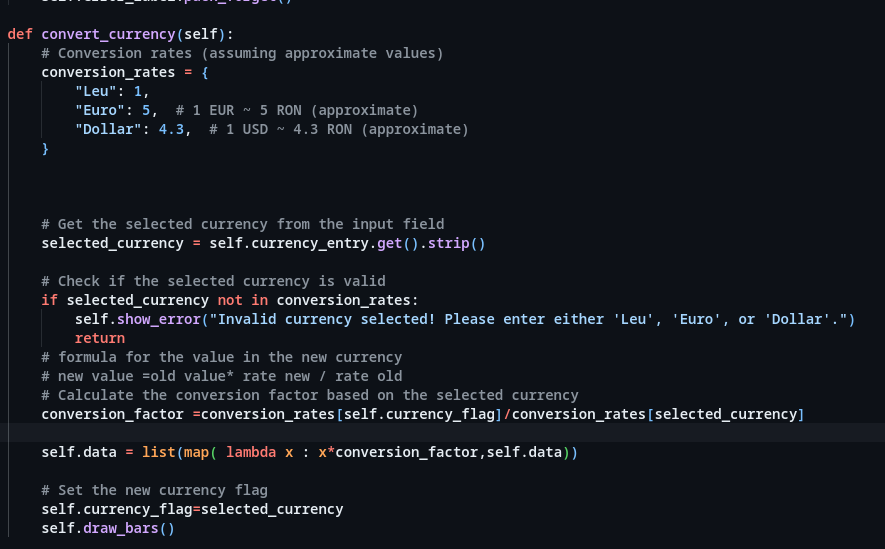

# Aplicatie de budgetare 
Aplicatie consta intr-un program scris in python, care cu ajutorul lui mysql ofera peristenta datelor. Utilizatorii pot sa seteze in cate zile este perioada de budgetare, cati bani au in fiecare zi ssmd.
### Screenshot cu UI

### Backlogul cu user stories:
https://trello.com/b/xGQJSRWC/proiect-gestionare-buget

### Diagrama UML

### Diagrama Bazei de date

### Prompt engineering 
Prompt:

Resultat (codul a fost modificat putin ca sa se incadreze in aplicatie):

### Teste automate

(implementat in metoda test_update_value in new.py)

### Rapoarte bug

(vezi backlog)

### Refactoring

Before:

After:
